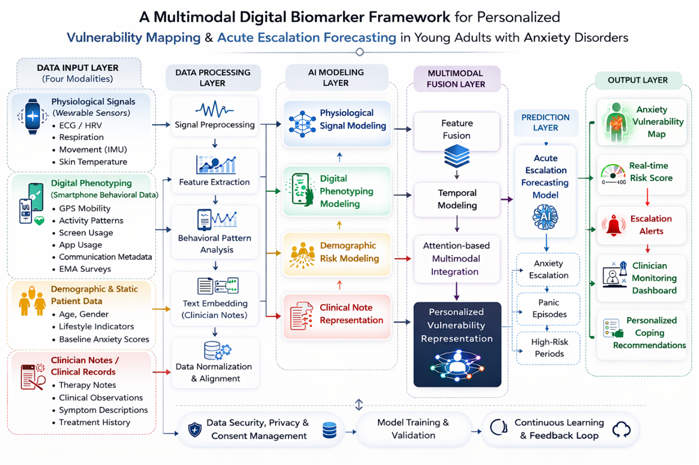

<div align="center">


<br/>

# A Multimodal Digital Biomarker Framework for Personalized Vulnerability Mapping and Acute Escalation Forecasting in Young Adults with Anxiety Disorders

**B.Sc. (Hons) Information Technology Specialized in Data Science**  
**Sri Lanka Institute of Information Technology (SLIIT)**  
**Department of Computer Science | 2026**

<br/>

<p align="center">
  
</p>


*Four tightly integrated components. One unified framework. Zero reliance on labeled anxiety episodes.*

<br/>

[](https://www.python.org/)
[](https://pytorch.org/)
[](https://flutter.dev/)
[](https://fastapi.tiangolo.com/)
[](https://firebase.google.com/)
[](./LICENSE)

</div>

---

## 📋 Table of Contents

- [Overview](#-overview)
- [The Problem](#-the-problem)
- [Components](#-components)
  - [Component 1 - Wearable Biosensor Forecasting](#-component-1--wearable-biosensor-forecasting-sendanayake-hd)
  - [Component 2 - Temporal Behavioral Graph Framework](#-component-2--temporal-behavioral-graph-framework-layathma-bmas)
  - [Component 3 - Personalized Intervention Framework](#-component-3--personalized-intervention-framework-seneviratne-kaua)
  - [Component 4 - Clinical NLP (TC-WPN)](#-component-4--clinical-nlp--tc-wpn-kaushalya-igd)
- [Research Team](#-research-team)
- [Supervisors](#-supervisors)
- [Tech Stack](#-tech-stack)
- [SDG Alignment](#-sdg-alignment)
- [Citation](#-citation)

---

## 🌐 Overview

Anxiety disorders affect an estimated 301 million people globally, yet the median delay between onset and first treatment contact exceeds **a decade**. In Sri Lanka, around 100 psychiatrists serve a population of 22 million, with only 10% of affected individuals ever accessing specialist services.

Existing tools are either too expensive, too reactive, or too general. Clinical appointments are episodic. Consumer wearables use population-level heuristics. AI systems require thousands of labeled examples that simply don't exist in most clinical settings.

**This research builds something different.**

This is a four-component unified framework that monitors anxiety continuously, predicts escalation before it happens, recommends personalized interventions, and adapts to each individual- all without requiring a single labeled anxiety episode for training.
The system spans the full clinical pipeline: from a custom-built chest-strap wearable and passive smartphone sensing, through a continuously learning intervention engine, to a few-shot clinical NLP model that works with just 10–20 labeled clinical notes.

---

## 🔴 The Problem

| Challenge | Why It Matters |
|-----------|---------------|
| Anxiety is continuous, not episodic | Clinical appointments capture snapshots, not the full picture |
| Supervised models need labeled data | Anxiety episodes are rare, hard to annotate, and highly individual |
| Wrist-based PPG is unreliable under stress | Motion artifacts corrupt signals precisely when they're most needed |
| Clinical NLP requires 1,000+ labeled examples | Most hospitals can annotate only 10–20 records per condition |
| Interventions are one-size-fits-all | What works for one person fails for another |


---

## 🧩 Components

### 🫀 Component 1 - Wearable Biosensor Forecasting *(Sendanayake H.D.)*

> *Self-supervised anomaly detection and 5-10 minute early warning forecasting using a custom chest-strap wearable.*

**The core idea:** Train a model only on what "normal" looks like for each person. Then, when their physiology starts deviating from that normal, flag it before a full anxiety escalation occurs. No labeled anxiety episodes needed.

#### 🔧 Hardware

| Sensor | Component | Measures |
|--------|-----------|----------|
| ECG / HRV | AD8232 | Cardiac rhythm, R-R intervals |
| Respiration | BF350-3AA Strain Gauge | Thoracic expansion / breathing rate |
| Inertial Motion | BMI160 IMU | 3-axis acceleration |
| Skin Temperature | DS18B20 | Peripheral temperature |
| Microcontroller | ESP32-C3 | Data acquisition + MQTT pipeline |

> Chest-strap configuration selected over wrist-based PPG for significantly improved ECG signal quality and respiration stability under movement.

#### 🤖 Model Architecture

```
Input: 60-second multivariate window (11 features, 50% overlap)
         │
         ▼
   ┌─────────────┐
   │  Encoder    │  ← LSTM layers
   │  (LSTM)     │
   └──────┬──────┘
          │  Bottleneck representation
   ┌──────▼──────┐
   │  Decoder    │  ← LSTM layers
   │  (LSTM)     │
   └──────┬──────┘
          │
          ▼
   Reconstruction Error  →  Anomaly Score  →  Adaptive Threshold
                                                      │
                                                      ▼
                                            Risk Probability [0, 1]
```


### 📱 Component 2 - Temporal Behavioral Graph Framework *(Layathma B.M.A.S.)*

> *Passive smartphone sensing modeled as temporal graphs, with GATv2 learning anxiety-predictive behavioral patterns.*

**The core idea:** Your phone already knows when you stop going places, when you stop sleeping properly, when you stop talking to people. Model those behavioral fingerprints as a graph over time- then let a graph neural network learn which patterns predict rising anxiety.

#### 📡 Passive Sensing Streams

| Stream | Method | Privacy Handling |
|--------|--------|-----------------|
| GPS / Mobility | FusedLocationProvider (15–30 min) | Stored as DBSCAN cluster IDs only |
| Physical Activity | ActivityRecognitionClient (5 min) | Aggregated activity types |
| Screen & App Usage | UsageStatsManager | Duration only, no app names |
| Communication | CallLog | Aggregate counts only |
| EMA | GAD-7 weekly, mood daily, PSS-4 bi-weekly | Self-reported |

#### 🕸 Graph Construction

```
Each day → 4 nodes (Morning / Afternoon / Evening / Night)
Each node → 10-dimensional behavioral feature vector

Edge Types:
  Type 1: Sequential (Morning → Afternoon → Evening → Night)  weight = 1.0
  Type 2: Cross-day  (same window, consecutive days)           weight = exp(−|d_i − d_j|)
  Type 3: Similarity (cosine similarity > 0.85)                weight = cosine score

42 days × 4 windows = 168 nodes per participant graph
```

#### 🧠 GATv2 Architecture

```
GATv2Conv (heads=4)  →  GATv2Conv (heads=2)  →  Global Attention Pooling  →  MLP  →  Vulnerability Score [0,1]
```

Behavioral phenotypes identified via K-Means (k=3):
- **Phenotype A** — Social-Spatial Withdrawal
- **Phenotype B** — Circadian Disruption
- **Phenotype C** — Hypervigilant Mobility

**Validation:** Dual-dataset strategy — primary app data + StudentLife benchmark (external, no retraining).

---

### 💊 Component 3 - Personalized Intervention Framework *(Seneviratne K.A.U.A.)*

> *A continuously learning KNN-CBR engine that recommends personalized anxiety interventions and adapts from physiological feedback.*

**The core idea:** When the system detects elevated risk, it doesn't just alert you- it recommends a specific intervention (breathing exercise, grounding technique, CBT prompt) based on what has actually worked for similar people before. And it keeps learning from whether the intervention helped.

#### 🔁 System Flow

```
Tri-modal Risk Vector (23 features)
  ├── Physiological: 8 features  (weight: 40%)
  ├── Behavioral:    9 features  (weight: 35%)
  └── Textual:       6 features  (weight: 25%)
          │
          ▼
  Gradient Boosting Classifier
          │
          ▼
  4-Tier Risk Label: LOW / MEDIUM / HIGH / CRITICAL
          │
          ▼
  KNN-CBR Engine (k=5, cosine similarity, BallTree indexing)
          │
          ▼
  Ranked Intervention Plan + XAI Justification
          │
          ▼
  Delivered via Flutter App
          │
          ▼
  Composite Reward: R = 0.35·ΔHR + 0.30·rating + 0.20·completion + 0.15·Δrisk
          │
          ▼
  BallTree Refit (every 10 feedback events)
```

**Escalation trigger:** Composite risk ≥ 0.85 sustained for ≥ 3 minutes → Firebase push notification to emergency contacts + clinician dashboard alert.

---

### 🏥 Component 4 - Clinical NLP / TC-WPN *(Kaushalya I.G.D.)*

> *A few-shot meta-learning model for clinical anxiety detection from sparse longitudinal clinical notes designed for deployment at Hospitals.*

**The core idea:** A hospital psychiatrist can realistically annotate maybe 15 notes. Standard NLP models need 5,000. TC-WPN bridges that gap by meta-training on a large external corpus and adapting to the local clinical context with just 10-20 labeled examples, while accounting for the fact that a note from last week matters more than one from three years ago.

#### 🧬 TC-WPN Algorithm

**Standard Prototypical Networks + two innovations:**

**1. Temporal Weighting**
```
w_temporal(x_i) = w_recency(t_i) × w_regularity(patient_i)

w_recency      = exp(−λ × (t_current − t_i) / 365)    λ = 0.5
w_regularity   = 1.0  if visits ≥ 3
               = 0.8 + 0.1 × num_visits  otherwise
```

**2. Confidence Weighting**
```
w_confidence(x_i) = 1 / (1 + β × H(x_i))

H(x_i) = Shannon entropy of class probability distribution
β = 1.0  (down-weights uncertain notes during prototype formation)
```

**TC-Weighted Prototype:**
```
p_c^TC = Σ(w_temporal × w_confidence × f_φ(x_i)) / Σ(w_temporal × w_confidence)
```

#### 📚 Data

| Source | Description | Volume |
|--------|-------------|--------|
| MIMIC-IV (PhysioNet) | Meta-training corpus | ~8,500 anxiety-positive + 15,000 non-anxiety psychiatric notes |
| NHSL Clinical Notes | Few-shot adaptation | 15–25 de-identified notes (binary annotated by psychiatrist) |

ICD-10 codes used: F41.0, F41.1, F41.3, F41.9, F40.00, F40.10

**Backbone:** Bio_ClinicalBERT → 768-dim → 256-dim projection (L2-normalized)  
**Training:** 10,000 meta-episodes, AdamW (lr=1e-5)  
**Adaptation:** Forward-pass only — no gradient computation needed at NHSL

---

## 👥 Research Team

| Student ID | Name | Component |
|-----------|------|-----------|
| IT22107596 | Sendanayake H.D. | 🫀 Wearable Biosensor Forecasting |
| IT22171542 | Layathma B.M.A.S. | 📱 Temporal Behavioral Graph Framework |
| IT22093950 | Seneviratne K.A.U.A. | 💊 Personalized Intervention Framework |
| IT22130648 | Kaushalya I.G.D. | 🏥 Clinical NLP - TC-WPN |

---

## 🎓 Supervisors

| Role | Name | Affiliation |
|------|------|-------------|
| Supervisor | Prof. Samantha Thelijjagoda | SLIIT |
| Co-Supervisor | Dr. Mahima Weerasinghe | SLIIT |
| External Supervisor | Dr. Chathurie Suraweera | Professor of Psychiatry, Faculty of Medicine, University of Colombo / NHSL |

---

## 🗂 Datasets

| Dataset | Access | Used In |
|---------|--------|---------|
| [WESAD](https://archive.ics.uci.edu/dataset/465/wesad+wearable+stress+and+affect+detection) | Public | C1 |
| [AffectiveROAD](https://affect.media.mit.edu/affectiveroad/) | Public | C1 |
| [PPG-DaLiA](https://archive.ics.uci.edu/dataset/495/ppg+dalia) | Public | C1 |
| [EmoWear](https://github.com/mjkillough/emowear) | Public | C1 (external validation) |
| [MIMIC-IV](https://physionet.org/content/mimiciv/2.2/) | PhysioNet DUA + CITI | C4 |
| [StudentLife](https://studentlife.cs.dartmouth.edu/) | Public | C2 (external validation) |
| NHSL Clinical Notes | IRB Approved — NHSL Ethics Review Committee | C4 |

---


## 🛠 Tech Stack

### Component 1: Wearable & ML


### Component 2: Graph ML


### Component 3: Intervention Engine


### Component 4: Clinical NLP


### Infrastructure


---


**Core commitments across all components:**
- 🔐 No raw sensor data transmitted beyond component boundaries — only risk scores
- 📍 GPS stored as DBSCAN cluster IDs only (never raw coordinates)
- 📞 Communication data as aggregate counts only (never content)
- 🏷 All clinical notes de-identified before processing
- 🚫 System explicitly framed as research / clinical decision support — not a diagnostic device
- ↩️ Right to withdraw at any time, for all participants

---

## 🌍 SDG Alignment

| SDG | How This Research Contributes |
|-----|-------------------------------|
| 🏥 **SDG 3** — Good Health and Well-Being | Proactive, accessible, continuous anxiety monitoring for a population with severe psychiatrist shortages |
| ⚖️ **SDG 10** — Reduced Inequalities | Smartphone-based passive sensing requires no expensive clinical infrastructure; scalable across socioeconomic boundaries |
| 🔬 **SDG 9** — Industry, Innovation, Infrastructure | Novel graph-based AI, self-supervised wearable biosensing, and few-shot meta-learning advancing the intersection of data science and digital health |

---

## 📝 Citation

If you use any part of this work, please cite:

```bibtex
@misc{r26ds012_2026,
  title     = {A Multimodal Digital Biomarker Framework for Personalized Vulnerability
               Mapping and Acute Escalation Forecasting in Young Adults with Anxiety Disorders},
  author    = {Sendanayake, H.D. and Layathma, B.M.A.S. and Seneviratne, K.A.U.A. and Kaushalya, I.G.D.},
  year      = {2026},
  note      = {R26-DS-012, B.Sc. (Hons) Information Technology (Data Science),
               Sri Lanka Institute of Information Technology (SLIIT)},
  supervisor= {Thelijjagoda, S. and Weerasinghe, M.}
}
```

---

<div align="center">

**Sri Lanka Institute of Information Technology (SLIIT)**  
Department of Computer Science | Faculty of Computing  
Malabe, Sri Lanka

*Supervised by Prof. Samantha Thelijjagoda and Dr. Mahima Weerasinghe*  
*External Guidance by Dr. Chathurie Suraweera, NHSL / University of Colombo*

<br/>


</div>
