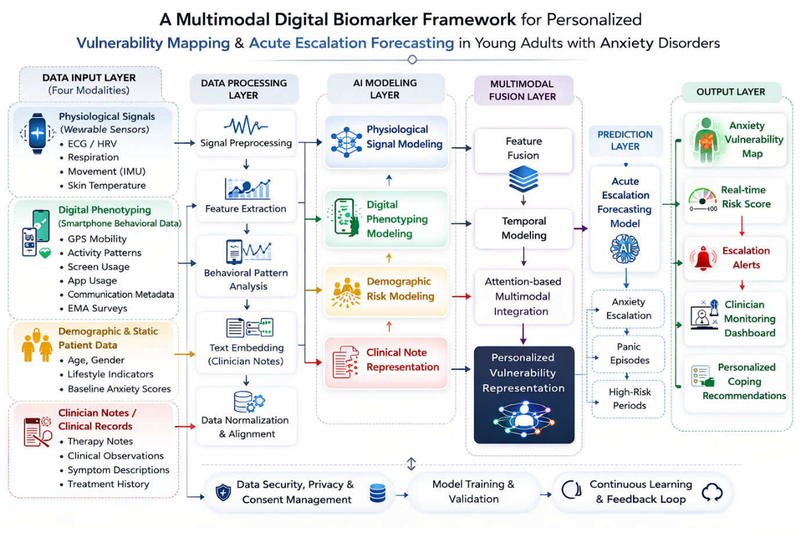

<div align="center">


<br/>

# A Multimodal Digital Biomarker Framework for Personalized Vulnerability Mapping and Acute Escalation Forecasting in Young Adults with Anxiety Disorders

**B.Sc. (Hons) Information Technology Specialized in Data Science**  
**Sri Lanka Institute of Information Technology (SLIIT)**  
**Department of Computer Science | 2026**

<br/>

<p align="center">
  
</p>

*Four integrated research components. One multimodal framework. Validation-aware outputs with explicit safety and fusion gates.*

<br/>

[](https://www.python.org/)
[](https://pytorch.org/)
[](https://flutter.dev/)
[](https://fastapi.tiangolo.com/)
[](https://supabase.com/)
[](./LICENSE)

</div>

---

## 📋 Table of Contents

- [Overview](#-overview)
- [The Problem](#-the-problem)
- [Components](#-components)
  - [Component 1 - Wearable Biosensor Forecasting](#-component-1---wearable-biosensor-forecasting-sendanayake-hd)
  - [Component 2 - Spatio-Temporal Graph Learning](#-component-2---spatio-temporal-graph-learning-layathma-bmas)
  - [Component 3 - Clinical NLP / TC-WPN](#-component-3---clinical-nlp--tc-wpn-kaushalya-igd)
  - [Component 4 - Multimodal Risk Fusion and RAG Decision Support](#-component-4---multimodal-risk-fusion-and-rag-decision-support-seneviratne-kaua)
- [Research Team](#-research-team)
- [Supervisors](#-supervisors)
- [Tech Stack](#-tech-stack)
- [Privacy and Research-Safety Commitments](#-privacy-and-research-safety-commitments)
- [Citation](#-citation)

---

## 🌐 Overview

Anxiety disorders affect millions of people worldwide, while access to continuous and personalized mental-health monitoring remains limited. Clinical appointments provide important but episodic snapshots, and anxiety-related changes can also appear in physiology, everyday behaviour, and clinical documentation at different timescales.

**This research investigates a multimodal alternative.**

The project combines four complementary research components:

1. **Wearable physiological sensing** for self-supervised anomaly detection and short-horizon escalation forecasting.
2. **Passive smartphone sensing** represented as spatio-temporal graphs and evaluated under strict participant-grouped, cross-cohort validation.
3. **Few-shot clinical NLP** using TC-WPN to classify anxiety-related clinical notes while explicitly controlling patient leakage and benchmark contamination.
4. **Contextual risk modelling, reliability-weighted multimodal fusion, and retrieval-augmented decision support** with evidence-quality and abstention safeguards.

The components do **not** all use the same learning paradigm. Component 1 is primarily self-supervised; Components 2 and 3 use labelled benchmark data for evaluation/training; Component 4 combines eligible component outputs with contextual information and evidence retrieval.

> **Research use only:** The framework is designed for research and clinical decision support. It is not a diagnostic device and its outputs must not be interpreted as a diagnosis of an anxiety disorder.

---

## 🔴 The Problem

| Challenge | Why It Matters |
|-----------|---------------|
| Anxiety-related change is continuous and multimodal | Clinical appointments capture only part of the person's changing state |
| Physiological baselines differ across people | A population threshold may not represent an individual's normal physiology |
| Passive behavioural signals are noisy and cohort-dependent | Apparent performance can disappear under leakage-free external evaluation |
| Clinical NLP has limited labelled data | Patient-level leakage and text-derived labels can strongly inflate results |
| Modalities operate on different timescales | A minute-level physiological signal, multi-week behaviour, and a clinical note cannot be treated as identical evidence |
| Missing or weak modalities are common | A safe system must be able to withhold a decision rather than inventing a score |

---

## 🧩 Components

### 🫀 Component 1 - Wearable Biosensor Forecasting *(Sendanayake H.D.)*

> *Personalized self-supervised physiological anomaly detection and short-horizon escalation forecasting using a custom chest-strap wearable.*

**The core idea:** Learn each person's baseline physiology rather than requiring large numbers of labelled anxiety episodes. Deviations from the learned physiological baseline produce an anomaly signal that can be used by a short-horizon forecasting stage.

#### 🔧 Hardware

| Sensor | Component | Measures |
|--------|-----------|----------|
| ECG / HRV | AD8232 | Cardiac rhythm and R-R intervals |
| Respiration | BF350-3AA strain gauge | Thoracic expansion / breathing rate |
| Inertial Motion | BMI160 IMU | 3-axis acceleration |
| Skin Temperature | DS18B20 | Peripheral temperature |
| Microcontroller | ESP32-C3 | Data acquisition and wearable communication |

The mobile integration uses the chest strap as the physiological source while the server-side model performs calibration, feature ingestion, anomaly processing, and forecasting.

#### 🤖 Physiological Feature Contract

The current paper-aligned physiological window contains **10 features**:

- mean heart rate
- mean R-R interval
- SDNN
- RMSSD
- mean breathing rate
- breathing-rate variability
- mean temperature
- temperature variability
- mean acceleration magnitude
- acceleration variability

#### 🧠 Model Flow

```text
60-second physiological feature window
            │
            ▼
      LSTM Autoencoder
            │
            ▼
   Reconstruction Error
            │
            ▼
      Anomaly Signal
            │
            ▼
 Short-horizon forecasting
            │
            ▼
 Physiological risk trajectory / index
```

The component repository evaluates the approach across benchmark datasets including WESAD, AffectiveROAD, PPG-DaLiA, and EmoWear, using subject-level evaluation and personalization experiments.

---

### 📱 Component 2 - Spatio-Temporal Graph Learning *(Layathma B.M.A.S.)*

> *Leakage-free spatio-temporal graph learning for anxiety vulnerability mapping from passive smartphone sensing.*

**The core idea:** Evaluate whether temporal relationships in passive behavioural data provide generalizable anxiety-vulnerability information beyond simpler flat feature models.

> **Final source of truth:** `graph-behavioral-phenotyping-FULL-v8/` replaces the earlier StudentLife, GPS/DBSCAN, hourly-risk, and phenotype-deployment pipeline for the final dissertation/paper.

#### 📚 Dataset and Target

**GLOBEM multi-year dataset**

| Cohort | Year | Role |
|--------|------|------|
| INS-W_1 | 2018 | Model / hyperparameter selection only |
| INS-W_2 | 2019 | Held-out evaluation |
| INS-W_3 | 2020 | Held-out evaluation |
| INS-W_4 | 2021 | Held-out evaluation |

The target is the released binary `anx_weekly_subscale`, corresponding to the PHQ-4 anxiety subscale / GAD-2-derived label in GLOBEM.

#### 🕸 Final Graph Construction

For each labelled week:

```text
Previous 28 days of passive sensing
            │
            ▼
4 daily segments
Morning / Afternoon / Evening / Night
            │
            ▼
Node = available day × time-segment cell
            │
            ├── within-day edges:
            │   adjacent time segments
            │
            └── across-day edges:
                same time segment on consecutive days
```

The executed final pipeline selected **40 behavioural feature bases**. Each graph node contains:

```text
40 behavioural values
+
40 explicit missingness indicators
=
80 raw node features
```

The evaluation compares **GATv2** with Logistic Regression, Random Forest, and Gradient Boosting baselines under participant-grouped evaluation.

#### 📊 Final Leakage-Free Result

| Model | AUROC |
|------|------:|
| Logistic Regression | 0.5458 |
| Random Forest | 0.5617 |
| Gradient Boosting | **0.5681** |
| GATv2 | 0.5205 |

For GATv2:

- Held-out AUROC: **0.5205**
- 95% participant-clustered CI: **0.485–0.560**
- AUPRC: **0.2270**
- 50-permutation null mean: **0.4991**
- Empirical permutation p-value: **0.255**

The final held-out GATv2 result was **not distinguishable from chance**, and the graph representation did not outperform the simpler flat behavioural baselines.

#### 🛡 Deployment Decision

The earlier vulnerability score, hourly high-risk window, and phenotype outputs are retained only as historical exploratory work. They are **not validated clinical outputs of the final v8 study**.

```text
Component 2 active fusion weight = 0.0
```

Component 2 may still support research logging, descriptive behavioural observations, data-quality monitoring, and future model development, but its current model output should not be presented as a calibrated clinical anxiety probability.

---

### 🏥 Component 3 - Clinical NLP / TC-WPN *(Kaushalya I.G.D.)*

> *Patient-disjoint few-shot clinical NLP for anxiety detection using Temporal-Consistency Weighted Prototypical Networks.*

**The core idea:** Build a few-shot clinical NLP system that can learn from small labelled support sets without allowing the same patient to appear in both support and query data and without deriving labels from the note text itself.

#### 📚 Publication-Clean Benchmark

The current benchmark uses a clean MIMIC-IV pipeline with:

- patient-disjoint support and query episodes
- structured cohort construction
- fixed index-time policies
- explicit leakage certificates
- frozen episode plans
- shallow baselines before neural comparison
- blinded robustness arms
- MIMIC-III reserved for cross-dataset transfer rather than mixed into training

The benchmark distinguishes:

| Index policy | Research task |
|-------------|---------------|
| `at_or_before` | Concurrent anxiety detection |
| `strictly_before` | Prospective detection |
| `none` | Retrospective association only |

#### 🧬 TC-WPN Architecture

The full configured model uses:

```text
Bio_ClinicalBERT
      │
      ▼
256-dimensional projection
      │
      ▼
Prototypical few-shot classifier
      │
      ├── Temporal weight (wT)
      ├── Prototype-consistency weight (wC)
      ├── Learned temperature (τ)
      └── Auxiliary cross-entropy head
```

The `wC` term is **prototype consistency**, not calibrated confidence. It measures how typical a support note is relative to its class prototype.

The repository's paper-aligned result reports a clinical-note AUROC of approximately **0.738** in the deployment-relevant held-out setting used by the fusion design.

---

### 🧠 Component 4 - Multimodal Risk Fusion and RAG Decision Support *(Seneviratne K.A.U.A.)*

> *Contextual risk modelling, reliability-weighted multimodal fusion, and evidence-aware retrieval-augmented decision support.*

The current repository architecture defines Component 4 as:

```text
DCAR contextual / demographic prior
            +
eligible component outputs
            ↓
Reliability-weighted fusion
            ↓
Low / Medium / High tier
            ↓
Retrieval-augmented decision support
```

It is **not** the older GBDT → KNN-CBR intervention engine previously described in the root README.

#### ⚖️ Reliability-Weighted Fusion

The current reference fusion uses a specified, interpretable weighting rule:

```text
w_m(t) = ω_m × ρ_m(Δt) × c_m

α_m = w_m / Σw

S(t) = Σ α_m × p_m
```

where:

- `ω` represents deployment-relevant informativeness above chance
- `ρ` applies modality-specific recency decay
- `c` scales the contribution using reliability / coverage information
- unavailable modalities are masked rather than interpreted as zero risk

A component that fails its own permutation-null criterion receives zero base weight. Under the current evidence, **Component 2 is therefore excluded from active fusion**.

The fusion output uses **three decision tiers**:

```text
Low
Medium
High
```

The UI may map these states plus unavailable/insufficient evidence to different display colours, but this does not create a fourth clinical tier.

A demographic/contextual prior is deliberately prevented from producing a tier by itself; the system can return **insufficient evidence** instead of manufacturing a low-risk result.

#### 📖 CARE-AnxRAG

The repository also contains **CARE-AnxRAG**: a contradiction-, authority-, reliability-, and evidence-aware RAG system for anxiety information research.

Implemented safeguards include:

- hybrid dense + lexical retrieval
- Reciprocal Rank Fusion
- CrossEncoder reranking
- evidence authority and freshness scoring
- provenance and source versioning
- contradiction detection
- calibrated abstention when evidence is weak or conflicting
- citation validation
- crisis / urgent-message routing before ordinary retrieval
- FastAPI service and evaluation harness

CARE-AnxRAG is a **research and engineering system, not a clinical device**.

---

## 👥 Research Team

| Student ID | Name | Current Component |
|-----------|------|-------------------|
| IT22107596 | Sendanayake H.D. | 🫀 C1 — Wearable Biosensor Forecasting |
| IT22171542 | Layathma B.M.A.S. | 📱 C2 — Spatio-Temporal Behavioural Graph Learning |
| IT22130648 | Kaushalya I.G.D. | 🏥 C3 — Clinical NLP / TC-WPN |
| IT22093950 | Seneviratne K.A.U.A. | 🧠 C4 — Contextual Modelling, Multimodal Fusion & RAG Decision Support |

---

## 🎓 Supervisors

| Role | Name | Affiliation |
|------|------|-------------|
| Supervisor | Prof. Samantha Thelijjagoda | SLIIT |
| Co-Supervisor | Dr. Mahima Weerasinghe | SLIIT |
| External Supervisor | Dr. Chathurie Suraweera | Professor of Psychiatry, Faculty of Medicine, University of Colombo / NHSL |

---

## 🛠 Tech Stack

### Component 1: Wearable & Physiological ML


### Component 2: Behavioural Graph ML


### Component 3: Clinical NLP


### Component 4: Fusion & RAG


### Mobile & Research Infrastructure


---

## 🔐 Privacy and Research-Safety Commitments

**Core commitments across the integrated system:**

- 🔐 Fusion consumes **component-level outputs and status metadata**, not raw modality streams as interchangeable features.
- 📍 Mobile location is **coarsened on-device** before research upload; the current Android collector rounds latitude/longitude to three decimal places.
- 📱 App identities are pseudonymous participant codes rather than participant names.
- 📞 Communication sensing stores **aggregate call/SMS counts**, not message bodies, phone numbers, contact names, or call content.
- 🏷 Clinical data used for research must be appropriately de-identified and governed by the applicable dataset / institutional access requirements.
- 🚫 Weak, unavailable, stale, or unvalidated modalities can be withheld from fusion rather than being treated as zero risk.
- 🧪 Component 2's final v8 output is explicitly **not** a validated clinical anxiety probability and currently receives zero active fusion weight.
- 📖 RAG outputs are evidence-gated and may abstain when relevance, quality, diversity, or conflict checks fail.
- 🩺 The integrated framework is explicitly framed as **research / clinical decision support, not a diagnostic medical device**.
- ↩️ Participants retain the right to withdraw in accordance with the approved study protocol.

---

## 📝 Citation

If you use any part of this work, please cite:

```bibtex
@misc{r26ds012_2026,
  title     = {A Multimodal Digital Biomarker Framework for Personalized Vulnerability
               Mapping and Acute Escalation Forecasting in Young Adults with Anxiety Disorders},
  author    = {Sendanayake, H.D. and Layathma, B.M.A.S. and Seneviratne, K.A.U.A. and Kaushalya, I.G.D.},
  year      = {2026},
  note      = {R26-DS-012, B.Sc. (Hons) Information Technology (Data Science),
               Sri Lanka Institute of Information Technology (SLIIT)},
  supervisor= {Thelijjagoda, S. and Weerasinghe, M.}
}
```

---

<div align="center">

**R26-DS-012 · SLIIT · 2026**

</div>
